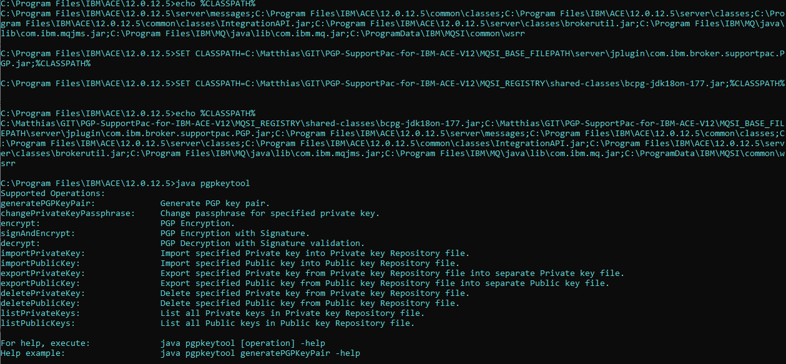

# PGP-Support-Pac-for-IBM-AppConnect-Enterprise-V12

## Description
PGP SupportPac for IBM App Connect Enterprise V12.0.10 onwards. It uses the compiled code from
[MyOpenTech-PGP-SupportPac](https://github.com/matthiasblomme/MyOpenTech-PGP-SupportPac) which on its own is a fork from
[dipakpal/MyOpenTech-PGP-SupportPac](https://github.com/dipakpal/MyOpenTech-PGP-SupportPac)

This project gives you all the jars you need to place on your system to get the PGP encryption/decryption up and running

## Content

### [MQSI_BASE_FILEPATH](MQSI_BASE_FILEPATH)
Jar files for server and tools

### [MQSI_REGISTRY](MQSI_REGISTRY)
Supported classes for pgp operations

### [Test Project](Test%20Project)
Test project interchange containing an aplication with an encryption and decryption flow. A policy project needs to be
created in order to be able to use it.

## Installation
All the files are bundled per location you need to create them. The folder structure is relative to yor system's
MQSI_BASE_FILEPATH and MQSI_REGISTRY variable. For instance, if you have

`MQSI_BASE_FILEPATH=C:\Program Files\IBM\ACE\12.0.11.3`

`MQSI_REGISTRY=C:\ProgramData\IBM\MQSI`

Then the full paths to cpy the files to will become

`C:\Program Files\IBM\ACE\12.0.11.3\server\jplugin`

`C:\Program Files\IBM\ACE\12.0.11.3\tools\plugins`

`C:\ProgramData\IBM\MQSI\shared-classes`

## pgpKeytool command line
Apart from installing and using the pgpt nodes in the toolkit, this deliverable also comes with a command line tool
to read, extract, import, ... in short create and handle pgp stores and keys. 

I am not going into detail on how to use it, please read the resources in the [Additional reading](#additional-reading) section.

Now, to the practical bit, in order to be able to run the java keytool command, you simply need to start the ACE console
for your desired ACE version and add 2 entries to the classpath
- bcpg-jdk18on-177.jar
- com.ibm.broker.supportpac.PGP.jar

With my code cloned to C:\Matthias\GIT\PGP-SupportPac-for-IBM-ACE-V12 (please update this to your local setup, and run this
from an ACE console)
```
SET CLASSPATH=C:\Matthias\GIT\PGP-SupportPac-for-IBM-ACE-V12\MQSI_BASE_FILEPATH\server\jplugin\com.ibm.broker.supportpac.PGP.jar;%CLASSPATH%
SET CLASSPATH=C:\Matthias\GIT\PGP-SupportPac-for-IBM-ACE-V12\MQSI_REGISTRY\shared-classes\bcpg-jdk18on-177.jar;%CLASSPATH%
```


## Status
| ACE Version | Status               | Date        |
|-------------|----------------------|-------------|
| 12.0.9.0    | Tested and validated | 2024/05/01  |
| 12.0.10.0   | Tested and validated | 2024/05/01  |
| 12.0.11.3   | Tested and validated | 2024/05/01  |
| 12.0.12.5   | Tested and validated | 2024/10/24  |

## Authors
| Name     | Role                     | Date       |
|----------|--------------------------|------------|
| Matthias | Upgrade pgp support jars | 2024/05/01 |
| Matthias | updated keytool info     | 2024/09/09 |

## Additional reading
[PGP SupportPac v1.0.0.2 IIBv10.ppt](https://github.com/dipakpal/MyOpenTech-PGP-SupportPac/blob/master/PGP%20SupportPac%20v1.0.0.2%20IIBv10.ppt)

[PGP Security Implementation in IBM Integration Bus v10 Part-1 PGP SupportPac User Guide.pdf](https://github.com/dipakpal/MyOpenTech-PGP-SupportPac/blob/master/docs/PGP%20Security%20Implementation%20in%20IBM%20Integration%20Bus%20v10%20Part-1%20PGP%20SupportPac%20User%20Guide.pdf)
