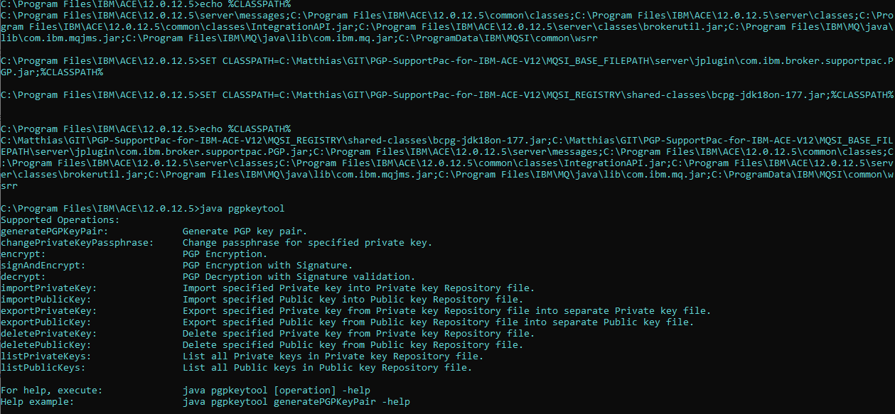

# PGP Support Pac for IBM App Connect Enterprise

## Description

PGP SupportPac for IBM App Connect Enterprise V12.0.9 onwards, including ACE 13.0.6.0. This project provides PGP encryption/decryption capabilities using Bouncy Castle libraries.

Based on compiled code from [MyOpenTech-PGP-SupportPac](https://github.com/matthiasblomme/MyOpenTech-PGP-SupportPac), which is a fork of [dipakpal/MyOpenTech-PGP-SupportPac](https://github.com/dipakpal/MyOpenTech-PGP-SupportPac).

## Quick Start

1. **Install the PGP SupportPac:**
   ```cmd
   cd installation-scripts
   install-pgp-supportpac.bat
   ```

2. **Test the installation:**
   - **Docker Testing (Recommended):** See [testing/docker/README.md](testing/docker/README.md)
   - **Standalone Server Testing:** See [testing/standalone-server/README.md](testing/standalone-server/README.md)
   - **All Testing Options:** See [testing/README.md](testing/README.md)

## Documentation

### Installation & Setup
| Document | Description |
|----------|-------------|
| **[INSTALLATION.md](INSTALLATION.md)** | Complete installation guide with automated and manual options |
| **[PGPKEYTOOL-COMMANDS.md](PGPKEYTOOL-COMMANDS.md)** | Complete pgpKeytool command reference |
| **[POLICY-CONFIGURATION-SUMMARY.md](POLICY-CONFIGURATION-SUMMARY.md)** | Policy configuration details and examples |

### Testing
| Document | Description |
|----------|-------------|
| **[testing/README.md](testing/README.md)** | Main testing guide - all testing approaches |
| **[testing/docker/README.md](testing/docker/README.md)** | Docker-based automated testing |
| **[testing/standalone-server/README.md](testing/standalone-server/README.md)** | Local Windows testing with ACE installed |
| **[testing/standalone-server/TEST-SETUP-WALKTHROUGH.md](testing/standalone-server/TEST-SETUP-WALKTHROUGH.md)** | Detailed step-by-step walkthrough with screenshots |
| **[testing/MIGRATION-GUIDE.md](testing/MIGRATION-GUIDE.md)** | Guide for migrating to new testing structure |

## Compatibility Status

| ACE Version | Status | Date | Notes |
|-------------|--------|------|-------|
| 12.0.9.0 | ✅ Tested and validated | 2024-05-01 | |
| 12.0.10.0 | ✅ Tested and validated | 2024-05-01 | |
| 12.0.11.3 | ✅ Tested and validated | 2024-05-01 | |
| 12.0.12.5 | ✅ Tested and validated | 2024-10-24 | |
| 13.0.6.0 | ✅ Tested and validated | 2026-02-12 | See [TEST-SETUP-WALKTHROUGH-ACE-13.md](TEST-SETUP-WALKTHROUGH-ACE-13.md) |

## What's Included

### JAR Files

**Server and Toolkit Plugins:**
- `PGPSupportPacImpl.jar` - Server-side implementation
- `PGPSupportPac.jar` - Toolkit plugin (adds PGP nodes to palette)

**Bouncy Castle Libraries:**
- `bcpg-jdk18on-1.78.1.jar` - PGP operations library
- `bcprov-jdk18on-1.78.1.jar` - Cryptography provider

### Test Project

- **TestPGP.zip** - Project Interchange containing:
  - Encryption flow (HTTP → PGP Encrypter → File)
  - Decryption flow (HTTP → PGP Decrypter → File)
  - Policy project with pre-configured policies

## pgpKeytool Command Line Utility

The PGP SupportPac includes a command-line tool for managing PGP keys and repositories.

### Quick Example

```cmd
REM Open ACE Command Console and set CLASSPATH
SET CLASSPATH=%MQSI_BASE_FILEPATH%\server\jplugin\PGPSupportPacImpl.jar;%CLASSPATH%
SET CLASSPATH=%MQSI_REGISTRY%\shared-classes\bcpg-jdk18on-1.78.1.jar;%CLASSPATH%
SET CLASSPATH=%MQSI_REGISTRY%\shared-classes\bcprov-jdk18on-1.78.1.jar;%CLASSPATH%

REM Generate a key pair
java pgpkeytool generatePGPKeyPair -i "User <user@example.com>" -s C:\keys\private.asc -o C:\keys\public.asc

REM List keys in a repository
java pgpkeytool listPrivateKeys -sr C:\keys\private-repository.pgp
```

**For complete command reference, see [PGPKEYTOOL-COMMANDS.md](PGPKEYTOOL-COMMANDS.md)**



## Project Structure

```
PGP-SupportPac-for-IBM-ACE-V12/
├── README.md                                    # This file
├── INSTALLATION.md                              # Installation guide
├── TEST-SETUP-WALKTHROUGH-ACE-13.md            # Complete testing walkthrough
├── PGPKEYTOOL-COMMANDS.md                      # Command reference
├── POLICY-CONFIGURATION-SUMMARY.md             # Policy details
├── installation-scripts/                        # Automated installation
│   └── install-pgp-supportpac.bat
├── MQSI_BASE_FILEPATH/                         # ACE installation files
│   ├── server/jplugin/PGPSupportPacImpl.jar
│   └── tools/plugins/PGPSupportPac.jar
├── MQSI_REGISTRY/                              # Shared libraries
│   └── shared-classes/
│       ├── bcpg-jdk18on-1.81.jar
│       └── bcprov-jdk18on-1.81.jar
└── testing/                                    # Testing framework
    ├── docker/                                 # Docker testing
    ├── standalone-server/                      # Standalone server testing
    ├── node-managed-server/                    # Node-managed testing
    └── test-resources/                         # Shared test resources
        ├── Sources/                            # ACE projects
        │   ├── PGP_Policies/                   # Policy project
        │   └── TestPGP_App/                    # Test application
        └── TestPgp_ProjectInterchange.zip      # Project Interchange
```

## Key Features

- ✅ **PGP Encryption/Decryption** - Full PGP support in ACE message flows
- ✅ **Bouncy Castle Integration** - Uses industry-standard Bouncy Castle libraries (v1.78.1)
- ✅ **Command-Line Tool** - pgpKeytool for key management
- ✅ **Toolkit Integration** - PGP nodes available in ACE Toolkit palette
- ✅ **Policy-Based Configuration** - Flexible policy-based key management
- ✅ **Automated Installation** - One-command installation script
- ✅ **ACE 13.x Compatible** - Tested and validated on ACE 13.0.6.0

## Getting Started

### 1. Installation

Run the automated installation script:

```cmd
cd installation-scripts
install-pgp-supportpac.bat
```

For detailed installation instructions, see [INSTALLATION.md](INSTALLATION.md)

### 2. Generate PGP Keys

```cmd
REM Set CLASSPATH in ACE Command Console
SET CLASSPATH=%MQSI_BASE_FILEPATH%\server\jplugin\PGPSupportPacImpl.jar;%CLASSPATH%
SET CLASSPATH=%MQSI_REGISTRY%\shared-classes\bcpg-jdk18on-1.78.1.jar;%CLASSPATH%
SET CLASSPATH=%MQSI_REGISTRY%\shared-classes\bcprov-jdk18on-1.78.1.jar;%CLASSPATH%

REM Generate sender key pair
java pgpkeytool generatePGPKeyPair -i "Sender <sender@example.com>" -s C:\keys\sender-private.asc -o C:\keys\sender-public.asc

REM Generate receiver key pair
java pgpkeytool generatePGPKeyPair -i "Receiver <receiver@example.com>" -s C:\keys\receiver-private.asc -o C:\keys\receiver-public.asc
```

### 3. Test the Installation

See the [testing/](testing/) directory for multiple testing approaches:
- **[Docker Testing](testing/docker/)** - Automated containerized testing
- **[Standalone Server](testing/standalone-server/)** - Local Windows testing
- **[Node-Managed Server](testing/node-managed-server/)** - Multi-server testing

Or follow the complete walkthrough in [TEST-SETUP-WALKTHROUGH-ACE-13.md](TEST-SETUP-WALKTHROUGH-ACE-13.md).

## Known Issues

### ⚠️ Docker UBI Image Classloader Issue (Work in Progress)

When using IBM ACE UBI (Universal Base Image) containers, the Java classloader may load older encryption JARs from the base image instead of the Bouncy Castle 1.81 JARs provided by this SupportPac.

**Status:** Under investigation
**Impact:** Docker testing only (standalone and node-managed deployments are not affected)
**Symptoms:** Encryption/decryption failures, classloader errors, wrong JAR versions loaded
**Workaround:** Use non-UBI ACE images or manually verify JAR versions in container

See [testing/docker/README.md](testing/docker/README.md) for more details and current investigation status.

## Authors & Contributors

| Name | Role | Date |
|------|------|------|
| Matthias | Upgrade PGP support jars | 2024-05-01 |
| Matthias | Updated keytool info | 2024-09-09 |
| Matthias | Added installation automation | 2026-02-11 |
| Matthias | ACE 13.0.6.0 validation and documentation | 2026-02-12 |

## Roadmap & Future Enhancements

### Planned Improvements

#### 🔧 Code Quality & Modernization
- [ ] **Refactor Java code to Java 17 standards**
  - Modernize code structure and patterns
  - Use Java 17 features (records, pattern matching, etc.)
  - Improve code readability and maintainability
  - Add comprehensive JavaDoc documentation

- [ ] **Remove passwords from policy files**
  - Implement secure credentials lookup in code
  - Support ACE vault integration
  - Support external credential stores (e.g., HashiCorp Vault, Azure Key Vault)
  - Add credential rotation support

#### 🔐 Security Enhancements
- [ ] **Enhanced key management**
  - Support for hardware security modules (HSM)
  - Key rotation automation
  - Audit logging for key operations
  - Support for multiple key algorithms (RSA, ECC, etc.)

- [ ] **Security hardening**
  - Input validation improvements
  - Secure memory handling for sensitive data
  - Security scanning and vulnerability assessment
  - FIPS 140-2 compliance support

#### 🚀 Feature Additions
- [ ] **Extended PGP operations**
  - Support for detached signatures
  - Support for clear-text signatures
  - Batch encryption/decryption operations
  - Streaming support for large files

- [ ] **Integration improvements**
  - REST API for key management
  - Kafka connector support
  - Cloud storage integration (S3, Azure Blob, etc.)
  - Message queue integration

#### 📚 Documentation & Testing
- [ ] **Enhanced documentation**
  - Video tutorials
  - More real-world examples
  - Performance tuning guide
  - Troubleshooting flowcharts

- [ ] **Testing improvements**
  - Automated integration tests
  - Performance benchmarks
  - Load testing scenarios
  - CI/CD pipeline setup

#### 🔄 Compatibility & Updates
- [ ] **Bouncy Castle updates**
  - Regular updates to latest Bouncy Castle versions
  - Security patch monitoring
  - Compatibility testing with new versions

- [ ] **ACE version support**
  - Test with future ACE releases
  - Support for ACE containers
  - Cloud Pak for Integration compatibility

### Community Contributions Welcome!

Have ideas for improvements? We'd love to hear from you!

1. **Open an issue** to discuss new features
2. **Submit a pull request** with your improvements
3. **Share your use cases** to help prioritize features

### How to Contribute to Roadmap

If you'd like to work on any of these items:
1. Comment on the related issue (or create one)
2. Fork the repository
3. Implement your changes
4. Submit a pull request with tests and documentation

---

## Additional Resources

- [PGP SupportPac v1.0.0.2 IIBv10.ppt](https://github.com/dipakpal/MyOpenTech-PGP-SupportPac/blob/master/PGP%20SupportPac%20v1.0.0.2%20IIBv10.ppt)
- [PGP Security Implementation in IBM Integration Bus v10 Part-1 PGP SupportPac User Guide.pdf](https://github.com/dipakpal/MyOpenTech-PGP-SupportPac/blob/master/docs/PGP%20Security%20Implementation%20in%20IBM%20Integration%20Bus%20v10%20Part-1%20PGP%20SupportPac%20User%20Guide.pdf)
- [PGP Security Implementation in IBM Integration Bus v9 Part-4 PGP Command-line tool User Manual.pdf](https://github.com/dipakpal/MyOpenTech-PGP-SupportPac/blob/master/docs/PGP%20Security%20Implementation%20in%20IBM%20Integration%20Bus%20v9%20Part-4%20PGP%20Command-line%20tool%20User%20Manual.pdf)

## License

This project is licensed under the **GNU Lesser General Public License v3.0 (LGPL-3.0)**.

### What This Means

✅ **Free to Use:**
- Use in production environments (including commercial)
- No licensing fees
- No usage restrictions

✅ **Modification Requirements:**
If you modify this software, you **must**:
1. Share your modifications with the community (via pull request or public repository)
2. Document your changes
3. Maintain this license and attribution

✅ **Integration Friendly:**
- Can be used with proprietary ACE applications
- Only modifications to the PGP SupportPac itself must be shared
- Your ACE flows and applications remain yours

### Why LGPL-3.0?

This license ensures:
- The community benefits from improvements
- Free production use for everyone
- Continued open-source development

**See [LICENSE](LICENSE) file for complete terms.**

### Contributing

Contributions are welcome! If you make improvements:
1. Fork the repository
2. Make your changes
3. Submit a pull request
4. Document what you changed and why

By contributing, you help the entire ACE community! 🎉
