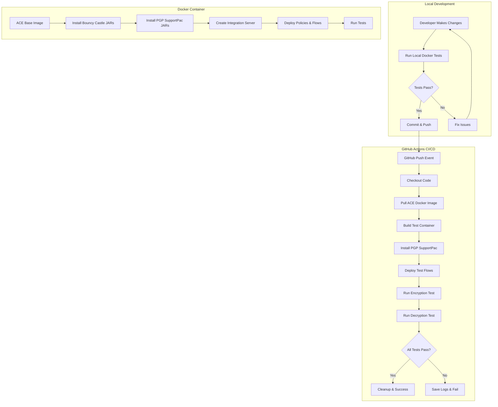

# Docker-Based Automated Testing Plan for PGP SupportPac

## Overview

This document outlines the comprehensive plan for implementing automated testing of the PGP SupportPac for IBM ACE using Docker containers. The solution has two main components:

1. **Local Docker Testing** - Run tests locally before committing changes
2. **GitHub Actions CI/CD** - Automated testing on every push to the repository

---

## Architecture Overview



---

## Part 1: Local Docker Testing

### 1.1 Docker Container Architecture

**Base Image**: IBM ACE from IBM Container Registry (icr.io)
- Image: `icr.io/appc/ace:13.0.6.0-r1` (or latest 13.0.x)
- Alternative: `cp.icr.io/cp/appc/ace-server` for Cloud Pak images

**Container Structure**:
```
ace-pgp-test-container/
├── /opt/ibm/ace-13/           # ACE installation
├── /home/aceuser/             # ACE user home
│   ├── ace-server/            # Integration server work directory
│   │   ├── shared-classes/    # Bouncy Castle JARs
│   │   ├── run/               # Deployed applications
│   │   └── log/               # Server logs
│   └── pgp-test/              # Test files
│       ├── keys/              # PGP key repositories
│       ├── input/             # Test input files
│       └── output/            # Test output files
└── /tmp/pgp-supportpac/       # Mounted source code
```

### 1.2 Docker Compose Configuration

**File**: `docker-compose.test.yml`

**Services**:
1. **ace-pgp-test** - Main ACE container for testing
   - Mounts local repository as volume
   - Exposes HTTP port for testing
   - Runs test script on startup
   - Keeps container on failure, removes on success

**Volumes**:
- `./` → `/tmp/pgp-supportpac` (source code)
- `./test-results` → `/home/aceuser/test-results` (test outputs)

**Environment Variables**:
- `LICENSE=accept` (ACE license acceptance)
- `ACE_SERVER_NAME=TEST_SERVER_PGP`
- `ACE_HTTP_PORT=7800`
- `ACE_ADMIN_PORT=7600`

### 1.3 Local Testing Workflow

**Script**: `test-docker-local.bat`

**Steps**:
1. Check Docker is running
2. Pull/verify ACE Docker image
3. Build custom test image (if needed)
4. Start docker-compose
5. Wait for container initialization
6. Monitor test execution
7. Display test results
8. On success: cleanup containers
9. On failure: keep container, display logs, provide inspection commands

**Usage**:
```cmd
REM Run tests with default settings
test-docker-local.bat

REM Run tests with specific ACE version
test-docker-local.bat --ace-version 13.0.6.0

REM Keep container even on success for inspection
test-docker-local.bat --keep-container

REM Clean up all test containers and volumes
test-docker-local.bat --cleanup
```

### 1.4 Test Execution Inside Container

**Script**: `/tmp/pgp-supportpac/docker/run-tests.sh`

**Test Sequence**:
1. **Setup Phase**
   - Copy PGP SupportPac JARs to ACE directories
   - Copy Bouncy Castle JARs to shared-classes
   - Copy test PGP keys to test directory
   - Create test directories (input/output)

2. **Server Initialization**
   - Create integration server
   - Deploy PGP_Policies project
   - Deploy TestPGP_App application
   - Wait for server to be ready

3. **Test Execution**
   - Create test input file
   - Test encryption flow (HTTP POST to /pgp/encrypt)
   - Verify encrypted file created
   - Test decryption flow (HTTP POST to /pgp/decrypt)
   - Verify decrypted file matches original

4. **Result Validation**
   - Compare original and decrypted files
   - Check for errors in server logs
   - Generate test report

5. **Cleanup/Preservation**
   - On success: exit with code 0
   - On failure: exit with code 1, preserve logs

---

## Part 2: GitHub Actions CI/CD

### 2.1 GitHub Actions Workflow

**File**: `.github/workflows/test-pgp-supportpac.yml`

**Trigger Events**:
- Push to main/master branch
- Pull requests to main/master
- Manual workflow dispatch
- Scheduled (optional: nightly builds)

**Jobs**:

#### Job 1: Test Installation and Functionality
**Runs on**: `ubuntu-latest`

**Steps**:
1. Checkout repository
2. Set up Docker Buildx
3. Login to IBM Container Registry (using secrets)
4. Pull ACE Docker image
5. Build test container
6. Run installation tests
7. Run encryption/decryption tests
8. Upload test artifacts (on failure)
9. Cleanup containers

**Secrets Required**:
- `IBM_ENTITLEMENT_KEY` - For accessing IBM Container Registry
- Or use public ACE images if available

### 2.2 GitHub Actions Test Matrix (Future Enhancement)

**Multiple ACE Versions**:
```yaml
strategy:
  matrix:
    ace-version: ['12.0.12.5', '13.0.6.0']
```

**Multiple Test Scenarios**:
- Basic encryption/decryption
- Large file handling
- Multiple key pairs
- Error scenarios

### 2.3 Artifact Management

**On Test Failure**:
- Upload server logs
- Upload test input/output files
- Upload container logs
- Retention: 7 days

**On Test Success**:
- No artifacts uploaded
- Summary in workflow log

---

## Part 3: Docker Implementation Details

### 3.1 Dockerfile Structure

**File**: `docker/Dockerfile.test`

**Base Image**: `icr.io/appc/ace:13.0.6.0-r1`

**Build Stages**:

1. **Stage 1: Base Setup**
   - Use official ACE image
   - Create test directories
   - Set up aceuser permissions

2. **Stage 2: Install PGP SupportPac**
   - Copy JAR files from repository
   - Install to correct ACE directories
   - Set proper permissions

3. **Stage 3: Test Setup**
   - Copy test projects
   - Copy PGP keys
   - Copy test scripts
   - Set entrypoint

**Key Considerations**:
- Run as `aceuser` (non-root)
- Proper file permissions for ACE
- Health check for server readiness
- Graceful shutdown handling

### 3.2 Docker Compose Configuration Details

**File**: `docker-compose.test.yml`

```yaml
version: '3.8'

services:
  ace-pgp-test:
    build:
      context: .
      dockerfile: docker/Dockerfile.test
      args:
        ACE_VERSION: ${ACE_VERSION:-13.0.6.0}
    container_name: ace-pgp-test
    hostname: ace-pgp-test
    environment:
      - LICENSE=accept
      - ACE_SERVER_NAME=TEST_SERVER_PGP
    ports:
      - "7800:7800"  # HTTP listener
      - "7600:7600"  # Admin REST API
    volumes:
      - ./:/tmp/pgp-supportpac:ro
      - test-results:/home/aceuser/test-results
    healthcheck:
      test: ["CMD", "curl", "-f", "http://localhost:7800/"]
      interval: 10s
      timeout: 5s
      retries: 5
      start_period: 30s
    networks:
      - ace-test-network

volumes:
  test-results:
    driver: local

networks:
  ace-test-network:
    driver: bridge
```

### 3.3 Test Script Implementation

**File**: `docker/run-tests.sh`

**Key Functions**:

```bash
#!/bin/bash
set -e

# Color output for readability
RED='\033[0;31m'
GREEN='\033[0;32m'
YELLOW='\033[1;33m'
NC='\033[0m' # No Color

log_info() { echo -e "${GREEN}[INFO]${NC} $1"; }
log_error() { echo -e "${RED}[ERROR]${NC} $1"; }
log_warn() { echo -e "${YELLOW}[WARN]${NC} $1"; }

# Test functions
test_installation() { ... }
test_encryption() { ... }
test_decryption() { ... }
verify_results() { ... }
cleanup_on_success() { ... }
preserve_on_failure() { ... }
```

---

## Part 4: File Structure

### 4.1 New Files to Create

```
PGP-SupportPac-for-IBM-ACE-V12/
├── docker/
│   ├── Dockerfile.test              # Test container image
│   ├── run-tests.sh                 # Test execution script
│   ├── entrypoint.sh                # Container entrypoint
│   └── README.md                    # Docker testing documentation
├── .github/
│   └── workflows/
│       └── test-pgp-supportpac.yml  # GitHub Actions workflow
├── docker-compose.test.yml          # Local testing orchestration
├── test-docker-local.bat            # Windows local test script
├── .dockerignore                    # Docker ignore file
└── DOCKER-TESTING-PLAN.md          # This document
```

### 4.2 Modified Files

**Existing files that may need updates**:
- `README.md` - Add Docker testing section
- `.gitignore` - Add Docker-related ignores
- `Test Project/Scripts/deploy_and_test.bat` - Reference for Docker script

---

## Part 5: Implementation Phases

### Phase 1: Local Docker Testing (Priority 1)
**Goal**: Enable developers to test locally before committing

**Tasks**:
1. Create `docker/Dockerfile.test`
2. Create `docker/run-tests.sh`
3. Create `docker-compose.test.yml`
4. Create `test-docker-local.bat`
5. Test and validate locally
6. Document usage

**Deliverables**:
- Working local Docker test environment
- Documentation for local testing
- Troubleshooting guide

**Estimated Effort**: 2-3 days

### Phase 2: GitHub Actions Integration (Priority 2)
**Goal**: Automated testing on every push

**Tasks**:
1. Create `.github/workflows/test-pgp-supportpac.yml`
2. Configure IBM Container Registry access
3. Set up GitHub secrets
4. Test workflow execution
5. Configure artifact uploads
6. Add status badges to README

**Deliverables**:
- Working GitHub Actions workflow
- CI/CD documentation
- Status badges

**Estimated Effort**: 1-2 days

### Phase 3: Enhancements (Future)
**Goal**: Extended testing capabilities

**Tasks**:
1. Add multi-version ACE testing
2. Add performance benchmarks
3. Add security scanning
4. Add custom ACE image building
5. Add test coverage reporting

**Deliverables**:
- Enhanced test matrix
- Performance metrics
- Security reports

**Estimated Effort**: 3-5 days

---

## Part 6: Technical Considerations

### 6.1 IBM ACE Docker Image Access

**Option 1: IBM Container Registry (Recommended)**
- Registry: `icr.io` or `cp.icr.io`
- Requires IBM Entitlement Key
- Access to official, supported images
- Regular updates and security patches

**Setup**:
```bash
# Login to IBM Container Registry
docker login icr.io -u cp -p <IBM_ENTITLEMENT_KEY>

# Pull ACE image
docker pull icr.io/appc/ace:13.0.6.0-r1
```

**Option 2: Custom Built Images (Future)**
- Build from ACE installation files
- More control over image contents
- No registry dependencies
- Requires ACE installation media

### 6.2 Container Resource Requirements

**Minimum Resources**:
- CPU: 2 cores
- Memory: 4 GB
- Disk: 10 GB

**Recommended Resources**:
- CPU: 4 cores
- Memory: 8 GB
- Disk: 20 GB

### 6.3 Network Configuration

**Ports**:
- `7800` - HTTP listener (for test requests)
- `7600` - Admin REST API (for management)

**Network Mode**:
- Bridge network for isolation
- Host network for debugging (optional)

### 6.4 Security Considerations

**Secrets Management**:
- PGP key passphrases in environment variables
- IBM Entitlement Key in GitHub secrets
- No hardcoded credentials in code

**Container Security**:
- Run as non-root user (aceuser)
- Read-only root filesystem where possible
- Minimal base image
- Regular security scanning

### 6.5 Performance Optimization

**Image Caching**:
- Use Docker layer caching
- Cache ACE base image locally
- Multi-stage builds for smaller images

**Test Execution**:
- Parallel test execution (future)
- Fast-fail on critical errors
- Incremental testing (future)

---

## Part 7: Testing Scenarios

### 7.1 Core Test Cases

**Test 1: Installation Verification**
- Verify all JAR files copied correctly
- Verify file permissions
- Verify ACE can load PGP nodes

**Test 2: Encryption Flow**
- Create test input file
- Trigger encryption via HTTP
- Verify encrypted file created
- Verify file is actually encrypted (not plain text)

**Test 3: Decryption Flow**
- Use encrypted file from Test 2
- Trigger decryption via HTTP
- Verify decrypted file created
- Verify content matches original

**Test 4: End-to-End Validation**
- Compare original and decrypted files byte-by-byte
- Verify no data corruption
- Check server logs for errors

### 7.2 Error Scenarios (Future)

**Test 5: Invalid Key**
- Attempt encryption with wrong key
- Verify proper error handling

**Test 6: Missing Files**
- Attempt operations with missing input files
- Verify graceful failure

**Test 7: Corrupted Encrypted File**
- Attempt decryption of corrupted file
- Verify error reporting

### 7.3 Performance Tests (Future)

**Test 8: Large File Handling**
- Encrypt/decrypt files of various sizes
- Measure performance metrics

**Test 9: Concurrent Operations**
- Multiple simultaneous encryption/decryption
- Verify thread safety

---

## Part 8: Monitoring and Debugging

### 8.1 Log Collection

**Container Logs**:
```bash
# View container logs
docker logs ace-pgp-test

# Follow logs in real-time
docker logs -f ace-pgp-test

# Save logs to file
docker logs ace-pgp-test > test-logs.txt
```

**ACE Server Logs**:
- Location: `/home/aceuser/ace-server/log/`
- Files:
  - `integration_server.TEST_SERVER_PGP.events.txt`
  - `integration_server.TEST_SERVER_PGP.txt`

### 8.2 Container Inspection

**On Test Failure**:
```bash
# Keep container running
docker-compose -f docker-compose.test.yml up --abort-on-container-exit=false

# Execute commands in container
docker exec -it ace-pgp-test bash

# Inspect files
docker exec ace-pgp-test ls -la /home/aceuser/pgp-test/

# View server status
docker exec ace-pgp-test mqsilist TEST_SERVER_PGP
```

### 8.3 Debugging Tips

**Common Issues**:
1. **Container won't start**
   - Check Docker daemon is running
   - Verify image pulled successfully
   - Check port conflicts

2. **Tests fail**
   - Check server logs
   - Verify JAR files installed
   - Check PGP key permissions

3. **Network issues**
   - Verify port mappings
   - Check firewall settings
   - Test with curl from host

---

## Part 9: Documentation Requirements

### 9.1 User Documentation

**Files to Create**:
1. `docker/README.md` - Docker testing guide
2. `DOCKER-TESTING-QUICKSTART.md` - Quick start guide
3. Update `README.md` - Add Docker testing section

**Content**:
- Prerequisites (Docker, Docker Compose)
- Installation instructions
- Usage examples
- Troubleshooting guide
- FAQ

### 9.2 Developer Documentation

**Files to Create**:
1. `docker/DEVELOPMENT.md` - Development guide
2. `docker/ARCHITECTURE.md` - Technical architecture

**Content**:
- Container architecture
- Build process
- Test script details
- Extension points
- Contributing guidelines

---

## Part 10: Success Criteria

### 10.1 Local Testing Success Criteria

✅ **Must Have**:
- [ ] Docker container builds successfully
- [ ] PGP SupportPac installs correctly
- [ ] Integration server starts without errors
- [ ] Encryption test passes
- [ ] Decryption test passes
- [ ] Original and decrypted files match
- [ ] Container cleanup works on success
- [ ] Container preserved on failure with logs

✅ **Should Have**:
- [ ] Clear console output with test progress
- [ ] Execution time < 5 minutes
- [ ] Helpful error messages
- [ ] Easy debugging on failure

### 10.2 GitHub Actions Success Criteria

✅ **Must Have**:
- [ ] Workflow triggers on push
- [ ] Workflow triggers on pull request
- [ ] All tests execute successfully
- [ ] Artifacts uploaded on failure
- [ ] Clear status reporting
- [ ] Workflow completes in < 10 minutes

✅ **Should Have**:
- [ ] Status badge in README
- [ ] Notification on failure
- [ ] Test result summary
- [ ] Reusable workflow components

---

## Part 11: Rollout Plan

### 11.1 Development Phase

**Week 1: Local Docker Testing**
- Day 1-2: Create Dockerfile and docker-compose
- Day 3-4: Create test scripts
- Day 5: Testing and refinement

**Week 2: GitHub Actions**
- Day 1-2: Create workflow file
- Day 3: Configure secrets and access
- Day 4-5: Testing and refinement

### 11.2 Testing Phase

**Internal Testing**:
- Test on developer machines (Windows)
- Test with different Docker versions
- Test failure scenarios
- Performance testing

**Documentation Review**:
- Review all documentation
- Add examples and screenshots
- Create video walkthrough (optional)

### 11.3 Release Phase

**Soft Launch**:
- Merge to feature branch
- Test with team members
- Gather feedback
- Iterate on improvements

**Full Release**:
- Merge to main branch
- Update README with Docker testing
- Announce to users
- Monitor for issues

---

## Part 12: Maintenance and Support

### 12.1 Regular Maintenance

**Monthly**:
- Update ACE base image to latest patch
- Update Bouncy Castle libraries if needed
- Review and update documentation

**Quarterly**:
- Test with new ACE versions
- Review and optimize performance
- Update test scenarios

### 12.2 Support Process

**Issue Reporting**:
- GitHub Issues for bugs
- Provide logs and container details
- Include Docker version and OS

**Troubleshooting**:
- Check documentation first
- Review common issues
- Provide detailed error messages

---

## Appendix A: Command Reference

### Docker Commands

```bash
# Build test image
docker build -f docker/Dockerfile.test -t ace-pgp-test:latest .

# Run container manually
docker run -it --rm -p 7800:7800 ace-pgp-test:latest

# View logs
docker logs ace-pgp-test

# Execute commands in container
docker exec -it ace-pgp-test bash

# Stop and remove container
docker stop ace-pgp-test && docker rm ace-pgp-test

# Clean up all test containers
docker-compose -f docker-compose.test.yml down -v
```

### Docker Compose Commands

```bash
# Start tests
docker-compose -f docker-compose.test.yml up

# Start in background
docker-compose -f docker-compose.test.yml up -d

# View logs
docker-compose -f docker-compose.test.yml logs -f

# Stop services
docker-compose -f docker-compose.test.yml down

# Clean up everything
docker-compose -f docker-compose.test.yml down -v --rmi all
```

---

## Appendix B: Environment Variables

### Container Environment Variables

| Variable | Default | Description |
|----------|---------|-------------|
| `LICENSE` | `accept` | ACE license acceptance |
| `ACE_SERVER_NAME` | `TEST_SERVER_PGP` | Integration server name |
| `ACE_HTTP_PORT` | `7800` | HTTP listener port |
| `ACE_ADMIN_PORT` | `7600` | Admin REST API port |
| `PGP_KEY_PASSPHRASE` | `passw0rd` | PGP key passphrase |
| `TEST_TIMEOUT` | `300` | Test timeout in seconds |

### GitHub Actions Secrets

| Secret | Required | Description |
|--------|----------|-------------|
| `IBM_ENTITLEMENT_KEY` | Yes | IBM Container Registry access |
| `DOCKER_USERNAME` | No | Docker Hub username (if needed) |
| `DOCKER_PASSWORD` | No | Docker Hub password (if needed) |

---

## Appendix C: Troubleshooting Guide

### Common Issues and Solutions

**Issue 1: Docker image pull fails**
```
Error: unauthorized: authentication required
```
**Solution**: Login to IBM Container Registry
```bash
docker login icr.io -u cp -p <IBM_ENTITLEMENT_KEY>
```

**Issue 2: Container exits immediately**
```
Error: Container ace-pgp-test exited with code 1
```
**Solution**: Check container logs
```bash
docker logs ace-pgp-test
```

**Issue 3: Port already in use**
```
Error: Bind for 0.0.0.0:7800 failed: port is already allocated
```
**Solution**: Stop conflicting service or change port
```bash
# Find process using port
netstat -ano | findstr :7800
# Kill process or change port in docker-compose.yml
```

**Issue 4: Tests timeout**
```
Error: Test execution timeout after 300 seconds
```
**Solution**: Increase timeout or check server logs
```bash
# Increase timeout in docker-compose.yml
environment:
  - TEST_TIMEOUT=600
```

---

## Document History

| Version | Date | Author | Changes |
|---------|------|--------|---------|
| 1.0.0 | 2026-02-13 | IBM Bob | Initial comprehensive plan |

---

**End of Document**